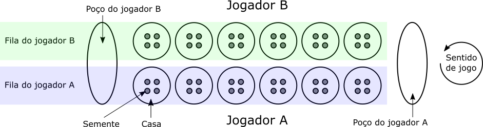
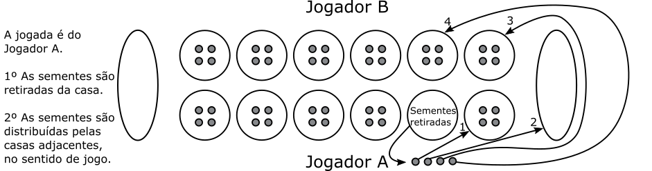

# [Fundamentos da Programação](https://mycampus.pt/courses/21494) - [IADE](https://www.iade.europeia.pt/) <!-- omit in toc -->

## Projeto <!-- omit in toc -->

- [Datas Relevantes](#datas-relevantes)
- [Descrição](#descrição)
  - [Regras](#regras)
  - [Jogo automático](#jogo-automático)
- [Instruções](#instruções)
  - [Registar jogador (RJ)](#registar-jogador-rj)
  - [Listar jogadores (LJ)](#listar-jogadores-lj)
  - [Iniciar jogo (IJ)](#iniciar-jogo-ij)
  - [Iniciar jogo automático (IJA)](#iniciar-jogo-automático-ija)
  - [Detalhes de jogo (DJ)](#detalhes-de-jogo-dj)
  - [Efetuar jogada (J)](#efetuar-jogada-j)
  - [Desistir de jogo (D)](#desistir-de-jogo-d)
  - [Gravar (G)](#gravar-g)
  - [Ler (L)](#ler-l)
- [Estrutura do projeto](#estrutura-do-projeto)
- [Testes de *input*/*output*](#testes-de-inputoutput)
  - [Utilização de testes](#utilização-de-testes)
- [Entrega](#entrega)
- [Prova de Autoria](#prova-de-autoria)
- [Tecnologias](#tecnologias)
- [Grupo de trabalho](#grupo-de-trabalho)
- [Avaliação](#avaliação)

## Datas Relevantes

| Data                    | Evento                         |
| ----------------------- | ------------------------------ |
| 30/10/2023              | Disponibilização do enunciado. |
| 02/01/2024 23:59:59 GMT | Entrega final do trabalho.     |
| 03/01/2024              | Provas de autoria.             |

## Descrição

*Mancala* corresponde a um tipo de jogo de tabuleiro, para dois jogadores competitivos, onde o objetivo é capturar peças.

Este projeto pretende a implementação de uma versão popular de Mancala.

Nesta versão, o tabuleiro consiste em 12 *casas* dispostas em duas filas. Cada fila pertence a um jogador. No início do jogo, cada casa tem 4 *sementes* (i.e., peças). Nas laterais do tabuleiro existem duas casas grandes denominadas *poços*.



O objetivo geral do jogo é capturar o maior número de sementes no poço, e a mecânica consiste em mover as sementes entre casas e poços, de acordo com um conjunto de regras, no sentido inverso aos ponteiros do relógio.

### Regras

O jogo inicia com 48 sementes, 4 por casa.

Cada jogador efetua uma jogada, à vez. Numa jogada, o jogador seleciona uma casa com sementes na sua fila, retira-as da casa, e deixa-as, uma a uma, nas casas adjacentes da sua fila, no seu próprio poço, e na fila do adversário (excluindo o poço do adversário), no sentido inverso aos ponteiros do relógio.



Regra A
: Se a última semente colocada for no poço, tem direito a uma nova jogada.

Regra B
: Se a última semente colocada for numa casa vazia da própria fila, tem direito a capturar essa semente, e todas as sementes da casa em frente, na fila do adversário. As sementes capturadas são colocadas no poço.

O jogo termina quando, depois de uma jogada, uma das filas fica sem sementes. O jogador que ainda tiver peças na sua fila captura-as para o seu poço. O vencedor é o jogador com mais sementes no poço.

### Jogo automático

Deve ser possível jogar contra o computador. Nesse caso, o jogador humano será o Jogador A, e o Jogador B corresponde a um jogador automático.

Para esse efeito serão considerados dois níveis de dificuldade: Normal, e Avançado.

No nível **Normal**, o jogador automático opta pela seguinte estratégia:

1. Seleciona a casa mais à esquerda possível para espalhar sementes.

No nível **Avançado**, o  jogador automático opta pelos seguintes passos, por ordem:

1. Se possível, seleciona uma casa que permita capturar as peças de uma das casas do oponente (ver Regra B).
2. Se possível, seleciona uma casa que permita terminar no poço, de forma a jogar novamente. Se existirem várias na mesma situação, opta pela mais à esquerda possível (ver Regra A).
3. Seleciona a casa mais à direita possível para espalhar sementes.

O nome do jogador autómatico, para efeitos de listagem de jogadores, é `CPU`.

## Instruções

Na descrição das várias instruções é indicada a sua sintaxe. Os argumentos são separados por espaços em branco, e cada linha é terminada por um caráter fim de linha.

Para cada instrução são indicadas as expressões de saída, quer para execuções com sucesso, quer para insucesso.

No caso de insucesso só deve surgir uma mensagem de erro. Verificando-se várias situações de insucesso em simultâneo, deve surgir apenas a mensagem do primeiro cenário, de acordo com a ordem de saídas de insucesso descritas para cada instrução.

Caso o utilizador introduza uma instrução inválida, ou seja, não prevista na lista de instruções desta secção, ou um número de parâmetros errado para uma instrução existente, o programa deve escrever:

    Instrução inválida.

Pode assumir que não existem erros de representação de informação (e.g., texto em vez de valores numéricos).

A descrição de cada instrução pretende ser exaustiva, sem ambiguidades, e suficiente. Não deve ser possível optar entre vários comportamentos possíveis na mesma situação. Se essa situação ocorrer deve entrar em contacto com equipa docente.

Nem todos os casos possíveis de interação estão previstos pelas instruções a implementar. Nessas situações, deve considerar que casos não previstos neste enunciado não serão testados. A implementação não deve suportar mais instruções do que as que estão descritas, no entanto, se forem acrescentadas instruções, estas devem ter o prefixo `X` (e.g., `XJ`).

O programa termina quando for introduzida uma linha em branco, fora do contexto de uma instrução.

### Registar jogador (RJ)

Regista um novo jogador.

`NomeJogador` é o nome de um jogador. O nome não tem espaços em branco, e não tem limite de carateres (estas regras aplicam-se sempre que, em qualquer instruções, surgir um nome de jogador).

Entrada:

    RJ NomeJogador

Saída com sucesso:

    Jogador registado com sucesso.

Saída com insucesso:

- Quando já existe um jogador registado com o mesmo nome:

      Jogador existente.

### Listar jogadores (LJ)

Lista os jogadores registados, indicando os registos de jogos jogados. Os jogadores são ordenados por número decrescente  de vitórias, e alfabeticamente para jogadores com o mesmo número de vitórias.

`NomeJogador` é o nome de um jogador. `NumJogos` representa o número de jogos jogados, `NumVitórias` representa o número de vitórias, `NumEmpates` representa o número de empates, e `NumDerrotas` represente o número de derrotas do jogador.

Entrada:

    LJ

Saída com sucesso:

    NomeJogador NumJogos NumVitórias NumEmpates NumDerrotas
    NomeJogador NumJogos NumVitórias NumEmpates NumDerrotas
    ...

Saída com insucesso:

- Quando não existem jogadores registados:

      Sem jogadores registados.

### Iniciar jogo (IJ)

Inicia um novo jogo entre dois jogadores.

`NomeJogadorA` e `NomeJogadorB` são os nomes dos jogadores A e B, respetivamente.

Entrada:

    IJ NomeJogadorA NomeJogadorB

Saída com sucesso:

    Jogo iniciado com sucesso.

Saída com insucesso:

- Quando já existe um jogo em curso:

      Existe um jogo em curso.

- Quando um dos jogadores indicados não se encontra registado:

      Jogador inexistente.

### Iniciar jogo automático (IJA)

Inicia um novo jogo contra um jogador automático.

`NomeJogador` é o nome de um jogador registado, e `Nível` é o nível de dificuldade do jogador automático (ver [descrição](#jogo-automático)).

Entrada:

    IJA NomeJogador Nível

Saída com sucesso:

    Jogo automático de nível Nível iniciado com sucesso.

Saída com insucesso:

- Quando já existe um jogo em curso:

      Existe um jogo em curso.

- Quando o jogador indicado não se encontra registado:

      Jogador inexistente.

### Detalhes de jogo (DJ)

Mostra os detalhes do jogo em curso. No ponto de vista de cada jogador, de frente para o tabuleiro, mostra o número de sementes nas 6 casas correspondentes, iniciando na casa mais à esquerda, e terminando no poço.

`NomeJogadorA` e `NomeJogadorB` são os nomes dos jogadores A e B, respetivamente. Cada posição mostra o número de sementes. Casas são apresentadas com parêntesis retos, e poços com parêntesis curvos. Atenção: as várias posições são separadas por tabs (`\t`) na representação.

Entrada:

    DJ

Saída com sucesso:

    NomeJogadorA X NomeJogadorB
    (Poço B)\t[Casa6 B]\t[Casa5 B]\t[Casa4 B]\t[Casa3 B]\t[Casa2 B]\t[Casa1 B]
    \t[Casa1 A]\t[Casa2 A]\t[Casa3 A]\t[Casa4 A]\t[Casa5 A]\t[Casa6 A]\t(Poço A)

Exemplo:

    André X Miguel
    [1]	(5)	(0)	(5)	(5)	(5)	(5)
    	(5)	(5)	(0)	(5)	(5)	(0)	[2]

Saída com insucesso:

- Quando não existe um jogo em curso:

      Não existe jogo em curso.

### Efetuar jogada (J)

Efetua uma jogada, indicando o número da casa correspondente, de acordo com o ponto de vista de cada jogador, de frente para o tabuleiro. A casa mais à esquerda tem identificador 1, e a mais à direita valor 6.

`NomeJogador` é o nome de um jogador. `Posição` é o identificador de uma casa (entre 1 e 6).

`NomeJogadorA` e `NomeJogadorB` são os nomes dos jogadores A e B, respetivamente. `NumSementes` é o número de sementes no poço, após o fim do jogo.

Entrada:

    J NomeJogador Posição

Saída com sucesso:

Nota: Deve surgir apenas uma saída com sucesso, com prioridade indicada pela seguinte ordem de saídas.

- Quando o jogo termina:

      Jogo terminado.
      NomeJogadorA NumSementes
      NomeJogadorB NumSementes

- Quando o jogador tem direito a uma nova jogada:

      O jogador NomeJogador tem direito a outra jogada.

- Quando a jogada termina:

      Jogada efetuada com sucesso.

Saída com insucesso:

- Quando não existe um jogo em curso:

      Não existe jogo em curso.

- Quando o jogador indicado não existe:

      Jogador inexistente.

- Quando o jogador indicado não participa no jogo em curso:

      Jogador não participa no jogo em curso.

### Desistir de jogo (D)

Regista a desistência do jogo por um ou dois jogador. No jogo automático apenas o jogador humano pode desistir. É registada uma derrota para cada jogador que desistiu, ou para ambos, caso os dois desistam. É registada uma vitória para o jogador que não desistiu.

`NomeJogador` representa o nome de um jogador que participa no jogo em curso.

Entrada:

Nota: o segundo `NomeJogador` é opcional.

    D NomeJogador NomeJogador

Saída com sucesso:

    Jogo terminado com sucesso.

Saída com insucesso:

- Quando não existe jogo em curso:

      Não existe jogo em curso.

- Quando um dos nomes indicados não pertence a um jogador registado:

      Jogador inexistente.

- Quando um dos jogadores indicados não participa no jogo em curso:

      Jogador não participa no jogo em curso.

### Gravar (G)

Grava o registo jogadores e jogos jogados num ficheiro. O jogo em curso não é gravado.

`NomeFicheiro` é o nome do ficheiro onde será feita a gravação.

Entrada:

    G NomeFicheiro

Saída com sucesso:

    Jogo gravado com sucesso.

Saída com insucesso: nenhuma.

### Ler (L)

Recupera o registo de jogadores e jogos jogados de um ficheiro. Esta operação só pode ser executada se não existir um jogo em curso, e substitui toda a informação existente.

`NomeFicheiro` é o nome do ficheiro de onde será feita a leitura.

Entrada:

    L NomeFicheiro

Saída com sucesso:

    Jogo lido com sucesso.

Saída com insucesso:

- Quando existe jogo em curso:

      Existe um jogo em curso.

## Estrutura do projeto

A estrutura to projeto está deve ser a seguinte:

      projeto
      |-- iotests/ : diretório com testes de output, a distribuir pela docência.
      |-- src/ : diretório com código fonte.
      |-- src/main.c : ficheiro com o ponto de entrada do programa.
      |-- Makefile : ficheiro com regras de compilação.
      |-- README.md : este ficheiro.
      |-- REPORT.md : relatório do projeto.

Para efetuar a atualizações:

1. Registar o repositório como `upstream` (só deve acontecer uma vez)

        git remote add upstream https://github.com/IADE-FP/FP-2023-2024-Project

2. Atualizar o `upstream` (sempre que existirem atualizações)

        git fetch upstream

3. Obter as alterações (e.g., ficheiro `README.md`)

        git checkout upstream/main README.md

## Testes de *input*/*output*

O projeto é validado através de um conjunto de baterias de teste de *input*/*output*.

Cada bateria é constituída por um ficheiro de entrada e outro e saída. O ficheiro de entrada contém uma sequência de instruções a passar pelo programa que, por sua vez, deve produzir uma sequência de saída *exatamente* igual ao ficheiro de saída. A comparação será feita *byte* a *byte*, pelo que não podem existir quaisquer diferenças para o programa ser considerado válido.

Os grupos de trabalho devem utilizar as baterias públicas para validar o desenvolvimento do projeto.

As baterias serão distribuídas através do repositório git de referência, na diretoria `iotests` (será necessário registar o repositório de referência como `upstream`, de acordo com as instruções na secção sobre [estrutura do projeto](#estrutura-do-projeto)).

### Utilização de testes

Os três testes disponibilizados devem ser utilizados por ordem, já que os cenários descritos num teste podem depender dos cenários dos testes anteriores. Cada teste deve ser utilizado da seguinte forma:

    ./program < 1.in > 1.mine.out

A instrução `<` redireciona o *standard input* para o ficheiro indicado, e a instrução `>` redireciona o *standard output* para o ficheiro indicado (cria se não existir, e escreve por cima se existir).

O `ficheiro 1.in` contém várias instruções para testar o programa. O ficheiro `1.out` contém as saídas correspondentes às instruções no `ficheiro 1.in`. O ficheiro `1.mine.out` será criado com as saídas que o programa gerar. Os ficheiros `1.out` e `1.mine.out` devem ser
idênticos.

A comparação entre ficheiros pode ser feita na linha de comandos, recorrendo ao programa `comp` em Windows, ou `diff` em Linux e MacOS.

A comparação também pode ser feita recorrendo a alguns IDEs ou editores de texto, tal como o *Visual Studio Code*. Para tal, abra o diretório do projeto em *File - Open Folder*. Selecione o diretório do projeto confirme em *Select Folder*. Caso não esteja visível, abra o explorador de ficheiros do *Visual Studio Code* em *View - Explorer*.

Selecione os dois ficheiros a comparar (selecione um, e selecione o outro enquanto pressiona na tecla `Ctrl`).


Com os dois ficheiros selecionados, utilize o botão direito do rato em cima da seleção para obter um menu. Escolha *Compare Selected*.


O *Visual Studio Code* apresenta os dois ficheiros com as diferenças a vermelho e verde. Caso não existam diferenças, as linhas dos dois ficheiros surgem sem cores.


## Entrega

A entrega do projeto é feita no *GitHub Classroom* e no *e-learning*.

A entrega no *e-learning* corresponde a um ficheiro `zip` do repositório *GitHub Classroom*.

Deve existir, na raiz do repositório:

- Um ficheiro chamado `Makefile`, com uma regra `main` que deve compilar o programa para `bin/main`.
- Um ficheiro de relatório `REPORT.md` com a identificação dos elementos do grupo de trabalho, e eventuais comentários relativos a estratégias de implementação adotadas, e/ou à distribuição de tarefas.

A ausência de identificação individual no ficheiro de relatório implica a anulação da participação individual no projeto.

O código fonte entregue será sujeito a validação por um conjunto de testes reservado para esse efeito, e será compilado com a seguinte instrução:

```bash
make main
```

A compilação deve gerar o programa `bin/main`, que será executado com as instruções dos testes.

A entrega no *e-learning* corresponde a um ficheiro `zip` do repositório *GitHub Classroom*, excluindo eventuais ficheiros compilados.

## Prova de Autoria

Todos os projetos entregues serão sujeitos a prova de autoria. Para esse efeito, cada grupo terá que efetuar uma discussão com a docência, de forma a demonstrar que o código entregue foi de facto feito pelo grupo, e que a distribuição de trabalho foi equilibrada.

O calendário das provas de autoria será disponibilizado no *e-learning*, após o prazo de entrega da implementação do projeto.

A não comparência na prova de autoria implica a anulação da participação individual no projeto.

## Tecnologias

O trabalho deve ser implementado em C (C11). Não podem ser utilizadas bibliotecas externas à distribuição padrão da linguagem. No caso de dúvida, os corpo docente deve ser consultado.

## Grupo de trabalho

Os grupos de trabalho devem ter até 4 pessoas. Idealmente, todos os elementos do grupo devem participar em todos os aspetos do projeto. No entanto, pode existir divisão de tarefas, sendo que esta deve ser equilibrada.

Grupos com um número diferente de pessoas devem ser explicitamente autorizados pelo corpo docente.

## Avaliação

O projeto é avaliado com base em duas componentes: quantitativa (*A*), e qualitativa (*B*). A nota final do projeto é determinada por *(0.5 x A) + (0.5 x B)*.

| Instrução | Peso |
| --------- | ---- |
| RJ        | 2    |
| LJ        | 2    |
| IJ        | 2    |
| IJA       | 4    |
| DJ        | 2    |
| J         | 3    |
| D         | 3    |
| G         | 1    |
| L         | 1    |

A avaliação qualitativa irá considerar que existem várias formas de resolver o problema descrito, mas exige-se a utilização dos instrumentos e métodos apresentados na unidade curricular, nomeadamente:

- Separação entre interface, dados, e lógica da aplicação.
- Justificação clara para as variáveis e operações implementadas.
- Organização da solução coerente com a metodologia apresentada na disciplina.

A implementação estrita de todas as instruções descritas neste enunciado assegura, sem prejuízo de reprovação por irregularidade académica, a nota mínima de 10 valores.

As notas finais do projeto serão disponibilizadas no *e-learning*.
